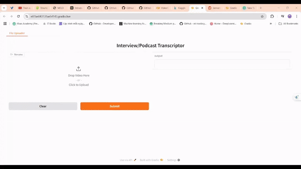

# Speech-Auto-Scripting

## Overview
**Speech-Auto-Scripting** is an AI-powered tool that automatically transcribes and structures spoken content from podcasts, interviews, academic speaking test, and other audio sources into readable scripts. This project leverages state-of-the-art speech recognition and natural language processing (NLP) techniques to generate accurate, well-organized transcripts.

## Demo


## Features
- **Automatic Speech-to-Text Conversion**: Uses advanced ASR (Automatic Speech Recognition) models to transcribe audio.
- **Speaker Diarization**: Identifies and segments different speakers in a conversation.
- **Content Summarization**: Generates concise summaries of transcriptions.
- **Text Structuring**: Formats transcripts into easy-to-read scripts.
- **Multi-Language Support**: Processes audio in multiple languages (if applicable).

## Technologies Used
- **Python**: Core programming language
- **TensorFlow / PyTorch**: For ASR model implementation
- **Whisper (by OpenAI)**: For high-quality speech recognition
- **Voice Activity Detection model (by pyannote)**: For speaker diarization
- **Gradio**: Creating user interface for web-application

## Installation
```bash
# Clone the repository
git clone https://github.com/your-username/Speech-Auto-Scripting.git
cd Speech-Auto-Scripting
```

## Usage
```bash
# Run the application on Colab environment with the .ipynb file

```

## Future Enhancements
- Optimize processing time and support large files
- Improve NLP-based content structuring
- Add more export formats (e.g., PDF, Word)
- Enhance accuracy for noisy environments
- Support more languages

## Contributing
Contributions are welcome! Please fork the repository and submit a pull request with improvements.


